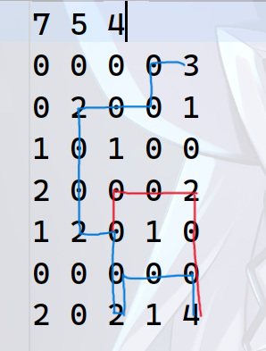
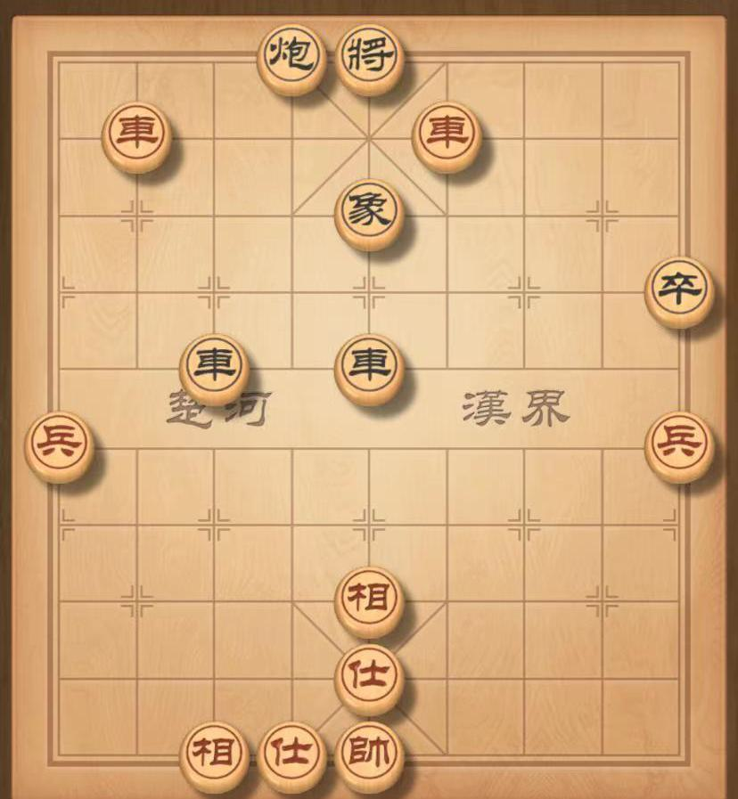

# 人工智能基础 Lab 1

## A\*
### 实验目的
使用 A\* 算法解决最大步数限制和障碍点限制下的寻路问题。

### 实现过程
项目的文件树为：

```bash
└─src
        Astar.cpp
        Astar.h
        main.cpp
        Map.cpp
        Map.h
        Point.h
```
其中 Astar.h，Astar.cpp 为 A\* 算法的声明和定义，Map.h，Map.cpp 为地图类的声明和定义，Point.h 为点类的声明。

这里，由于有最大步数的限制，我们需要在 A\* 算法中加入一个判断条件，即当前步数是否超过了最大步数限制。如果超过了最大步数限制，则直接返回，不再继续搜索。
这里与普通的 A\* 算法不同的是：如果搜索的结点在 close list 中，也是可能需要搜索的。因为如果该结点拥有的补给数大于在 close list 中的该结点，那么这个结点可以重新加入 open list 中，进行搜索，表明可能有更好的路径。

#### A\* 算法的伪代码：

```cpp
void Astar::AstarSearch() {
    status = AStarSearching;
    open_list.push(start_point);
    while(open_list is not empty) {
        curr_point = open_list.top();
        open_list.erase(top);

        close_list.push(curr_point);
        if (curr_point == end_point) {
            status = AStarFound;
            GetResult();
        }

        neighbor_points = getNeighborPoints(curr_point);
        for (neighbor_point in neighbor_points) {
            neighbor_point.g = curr_point.g + 1;
            neighbor_point.supply = neighbor_point is supply ? max_supply : curr_point.supply - 1;
            neighbor.h = getHeuristic(neighbor_point);

            if (neighbor_point not in close_list and not in open_list) {
                // 如果既不在 close list 中，也不在 open list 中，那么加入 open list 中
                set parent of neighbor_point to curr_point;
                open_list.push(neighbor_point);
            }
            else if (neighbor_point in open_list) {
                // 如果在 open list 中，找到对应的 neighbor_point_open，如果 neighbor_point.g < neighbor_point_open.g，那么更新 open_list
                find corresponding neighbor_point in open_list as neighbor_point_open;
                if (neighbor_point.g < neighbor_point_open.g) {
                    set parent of neighbor_point_open to curr_point;
                    neighbor_point_open.g = neighbor_point.g;
                    open_list.erase(neighbor_point_open);
                    open_list.push(neighbor_point);
                }
            }
            else {
                // 如果在 close list 中，找到对应的 neighbor_point_close，如果 neighbor_point.supply > neighbor_point_close.supply，那么重新放入 open list 中
                find corresponding neighbor_point in close_list as neighbor_point_close;
                if (neighbor_point.supply > neighbor_point_close.supply) {
                    set parent of neighbor_point_close to curr_point;
                    neighbor_point_close.supply = neighbor_point.supply;
                    open_list.push(neighbor_point_close);
                }
            }
        }
    }
    status = AStarNotFound; // 没有找到路径
    GetResult();
}
```

#### 反向搜索路径的伪代码：

```cpp
reverse close_list; // 反转 close list
it = close_list.begin()
curr_pos = it->pos;
parent_pos = it->parent_pos;

for (it++; it != close_list.end(); it++) {
    if (it->pos == parent_pos) {
        // 找到了父结点
        // 根据 curr_pos 和 parent_pos 输出路径

        curr_pos = it->pos;
        parent_pos = it->parent_pos;
    }
}
output to file;
```

### 启发式函数设计
#### 平凡启发式函数
以曼哈顿距离为启发式函数，即当前点到终点的曼哈顿距离。
如果当前补给已经耗尽，那么返回 -1，告知算法需要重新规划路径。

#### 非平凡启发式函数
考虑到只能上下左右移动，在当前拥有的补给为 r 时，可到的范围是以当前点为中心的一个正方形（旋转 45 度），其对角线长度为 2r + 1，设这个范围为 `SupplyRegion`，启发式函数设计如下：
1. 若终点在 `SupplyRegion` 中，则启发式函数为终点到当前点的曼哈顿距离
2. 若终点不在 `SupplyRegion` 中，则遍历所有补给点，将在 `SupplyRegion` 中的所有补给点到当前点的曼哈顿距离加上终点到该补给点的曼哈顿距离进小根堆，取最小值作为启发式函数
3. 若在 2 中找不到任何一个补给点，则返回 -1 告知算法需要重新规划路径，

看起来如果补给点在当前点与终点之间，则启发式函数的值与平凡的启发式函数相同。那么为什么要设计该启发式函数呢？这里借鉴了深度学习领域的 `early-stop`，即如果当前 `SupplyRegion` 中没有终点，并且当前所拥有的补给不足以到达任何一个补给点，那么就可以提前结束搜索，重新规划路径，从而提高搜索效率。这样只需要对每个点搜索补给点，而不需要再搜索它的所有邻居点。

这里还有一个疑问，如果对每个点搜索补给点，那么搜索的代价会不会更大？这里可以看一下搜索补给点的逻辑：

```cpp
    if (isInSupplyRegion(map.getEnd().getPos(), point.getPos(), curr_supply)) {
        return point.distance(map.getEnd());
    } else {
        std::priority_queue<int, std::vector<int>, std::greater<>> distances;  // 从小到大排序
        for (auto &supply_point: map.getSupplyPoints()) {
            if (isInSupplyRegion(supply_point, point.getPos(), curr_supply)) {
                distances.push(point.distance(Point(supply_point)) + Point(supply_point).distance(map.getEnd()));
            }
        }
        if (distances.empty()) {
            return -1;
        }
        return distances.top();
    }
```
这里 `isInSupplyRegion` 就是将两个点的曼哈顿距离与当前补给进行比较，与 `distance` 的复杂度相同，可以认为是 $O(1)$，假设补给点的数量为 $N_T$，那么第一个检查的复杂度为 $O(1)$，而 else 中建优先队列的复杂度为 $O(N_T)$，取最小值的复杂度为 $O(1)$，所以该启发式函数为 $O(N_T)$，而平凡的启发式函数为 $O(1)$。

考虑 A\* 搜索的复杂度，对于每一个在 open_list 中的结点，每一个平均需要计算其所有邻居点的启发式函数、更新其邻居点的父结点、更新其邻居点的 g 值，这个复杂度为 $O(N)$，其中 N 为所有搜索过的结点。

如果这种非平凡的启发式函数可以显著减少搜索的结点数量并且补给点较少，那么这种启发式函数是有效的。如果搜索的结点数量没有得到显著减少或补给点较多，那么搜索补给点的代价可能会更大，这种启发式函数的效果可能不如平凡的启发式函数。但在本实验看来，这种启发式函数的效果要好于平凡的启发式函数。
### 实验结果
实验结果分为时间和正确性两个方面。

#### 时间
1. 统计前 10 个样例的搜索时间的总和和第 11 个样例的时间，实验结果如下：

   | 样例 | 平凡启发式函数 | 非平凡启发式函数 |
   | --- | --- | --- |
   | 0-9 | 54ms | 38ms |
   | 10 | 1490ms | 1446ms |
   
   由于第 11 个样例太过特殊，由于没有补给点，所以非平凡启发式函数收敛为平凡启发式函数，所以时间差异不大。而前 10 个样例中，非平凡启发式函数的时间要小于平凡启发式函数的时间。

2. 统计所有样例的 `地图大小/搜索结点数/最终路径含结点数`

   | 样例 | 平凡启发式函数 | 非平凡启发式函数 |
   | --- | --- | --- |
   | 0 | 20/9/5   | 20/8/5|
   | 1 | no way   | no way |
   | 2 | 20/18/10 | 20/16/10 |
   | 3 | 30/22/9  | 30/16/9 |
   | 4 | 35/38/14 | 35/27/14 |
   | 5 | 64/32/15 | 64/30/15 |
   | 6 | 81/78/22 | 81/68/22 |
   | 7 | 100/70/21 | 100/44/21 |
   | 8 | 100/86/29 | 100/57/29 |
   | 9 | 900/492/252 | 900/486/252 |
   | 10 | 10000/10000/198 | 10000/10000/198 |

   可以看到，非平凡启发式函数的搜索结点数要远小于平凡启发式函数的搜索结点数，而最终路径含结点数相同。这里搜索结点数甚至会超过地图大小，这是因为在搜索过程中，需要考虑重复的情况，也就是 close list 里的点也有可能需要被重新搜索。

#### 正确性
以第 5 个样例为例：
原图为：

可以看出有两条路径可走，其中一个有重复结点，一个没有重复结点。实验结果如下：

程序结果：
```txt
14
LDLLDDDDDRURRD
```
可以看出，程序的结果是正确的。

## Alpha-Beta Pruning

### 实验目的

1. 实现中国象棋的行走逻辑和价值评估
2. 通过实现 $\alpha-\beta$ 剪枝算法来优化中国象棋的 AI 决策过程

### 实现过程

项目的文件树为：

```bash
└─src
   AlphaBeta.cpp
   AlphaBeta.h
   Chess.cpp
   Chess.h
   ChessBoard.cpp
   ChessBoard.h
   Evaluate.cpp
   Evaluate.h
   main.cpp
```

其中 Chess.h，Chess.cpp 为对 Chess 的类型和颜色的定义，ChessBoard.h，ChessBoard.cpp 为棋盘类（作为搜索结点）的声明和定义，Evaluate.h，Evaluate.cpp 为评估矩阵和评估函数的声明和定义，AlphaBeta.h，AlphaBeta.cpp 为 $\alpha-\beta$ 剪枝算法的声明和定义，main.cpp 传递程序实参并调用 $\alpha-\beta$ 剪枝算法。

本项目的两个难点为：

1. 根据棋子的类型和颜色，实现棋子的行走逻辑
2. 根据当前行走的 move，生成子结点，包括子结点的棋盘、子结点的所有可行走的 move、子结点是否结束等

#### 棋子的行走逻辑

对于 1，我们可以将 7 种子归类，其中车和炮的行走逻辑相同，都是从当前位置走直线，这时需要遍历四个方向。而马、士、象、卒、将的行走逻辑都是当前位置下只有若干个位置可以走，并且可能有蹩马腿或塞象眼的情况，这时只需要罗列出所有可能走的位置，再遍历即可。

以炮为例，炮的行走逻辑抽象如下：

- 从当前位置向上走，直到碰到第一个棋子，无论颜色，继续搜索
- 碰到第一个棋子，继续向上搜索，碰到第二个棋子，若是对方的棋子，则可以吃掉
- 如果没有碰到第二个棋子，或者碰到的第二个棋子是己方的棋子，则无法越过第一个棋子，搜索结束

```cpp
for (curr_pos -> boundary) {
    initialize move;
    if (first_obstacle_chess != Empty) {
        // 碰到第一个棋子，无论颜色，继续搜索
        for (first_obstacle_pos -> boundary) {
            if (second_obstacle_chess != Empty) {
                // 碰到第二个棋子，若是对方的棋子，则可以吃掉
                if (second_obstacle_chesscolor != curr_chess_color) {
                    // 炮可以吃掉对方的棋子
                    eat second_obstacle_chess;
                    push move into moves;
                }
                break;
            }
        }
        // 无论是否打到对方的棋子，都要跳出外层循环
        break;
    }
    push move into moves;
}
```

#### 生成子结点

根据当前行走的 move，生成子结点，包括子结点的棋盘、子结点的所有可行走的 move、子结点是否结束等，这里需要注意的是，对于子结点的棋盘，我们需要深拷贝当前棋盘，然后在子结点的棋盘上进行行走，而不是直接在当前棋盘上进行行走。

生成子结点的逻辑抽象如下：

- 深拷贝当前棋盘
- 行棋方颜色交换
- 根据 move，判断是否被吃将/帅，若是，则结束
- 根据 move，更新棋盘上的棋子位置
- 更新所有合法的走法（在更新时如果没有合法的走法，则是一种特殊情况：困毙，游戏结束）

```cpp
ChessBoard getChildChessBoardFromMove(move) {
    ChessBoard child_chess_board = deepcopy(curr_chess_board);

    change curr_color;

    if (move.is_eat && move.eat_chess == 将/帅) {
        // 被吃将/帅，游戏结束
        child_chess_board.is_end = true;
    }

    child_chess_board[move.to] = child_chess_board[move.from];
    child_chess_board[move.from] = Empty;

    child_chess_board.updateMoves();
}
```

### 评估函数设计

评估分数为：程序方的分数 - 对手方的分数

其中每一方的分数由三部分组成：包括

1. 当前棋局下当前方所有可行棋的行棋价值（只计吃对方子，未吃子设为 0）
2. 当前棋局下当前方所有棋子的位置权重
3. 当前棋局当前方所有棋子的固有价值总和

当然程序方 $\neq$ 当前方，红方永远是程序方，但红方下棋时，红方才是当前方，黑方下棋时，黑方是当前方。

### alpha-beta 剪枝（多线程版）

$\alpha-\beta$ 剪枝算法是一种优化的搜索算法，通过剪枝，减少搜索的分支，从而提高搜索效率。对于根节点，它必然需要遍历所有的子结点，对于每一个根结点的子结点，都会有一个 $\alpha-\beta$ 值，计算这个值是必须的，无法剪枝，并且这个计算是互相独立的，因此可以使用多线程来加速这个过程。

#### 朴素的 $\alpha-\beta$ 剪枝算法

伪代码如下：

```cpp
int AlphaBetaSearch(ChessBoard &node, int depth, int alpha, int beta, bool isMaxNode) {
    assert(isMaxNode == is_my_turn);

    if (depth == 0 || node.isStopGame()) {
        return node.getCurrChessBoardScore();
    }

    moves = node.getAllPossibleMoves();
    if (isMaxNode) {
        for (move: moves) {
            ChessBoard child_node = node.getChildChessBoardFromMove(move);
            alpha = std::max(alpha, AlphaBetaSearch(child_node, depth - 1, alpha, beta, false));
            if (alpha >= beta) {
                break;
            }
        }
        return alpha;
    } else {
        for (move: moves) {
            ChessBoard child_node = node.getChildChessBoardFromMove(move);
            beta = std::min(beta, AlphaBetaSearch(child_node, depth - 1, alpha, beta, true));
            if (alpha >= beta) {
                break;
            }
        }
        return beta;
    }
}

```

事实上，在对根节点应用 $\alpha-\beta$ 剪枝算法之后，我们还要对根节点的所有子结点应用 $depth - 1$ 的 $\alpha-\beta$ 剪枝算法，得到所有的子结点的 $\alpha-\beta$ 值，然后根据这些值与根结点的 $\alpha-\beta$ 值来选择最优的走法。

#### 多线程版

多线程的$\alpha-\beta$ 剪枝算法伪代码如下：

```cpp
std::pair<int, Move> AlphaBetaMultiThreadSearch(ChessBoard &node, int depth, int alpha, int beta, bool isMaxNode) {
    assert(isMaxNode == is_my_turn);
    assert(depth >= 1);

    if (node.isStopGame()) {
        return {END_GAME_SCORE, Empty move};
    }

    moves = node.getAllPossibleMoves();
    threads(moves.size());  // 线程池
    scores(moves.size());
    for (int i = 0; i < moves.size(); i++) {
        threads[i] = thread([&](){
            ChessBoard child_node = node.getChildChessBoardFromMove(moves[i]);
            scores[i] = AlphaBetaSearch(child_node, depth - 1, alpha, beta, !isMaxNode);
        });  // 将每一个子结点的搜索任务放入线程池
    }
    // 等待所有线程结束
    for (int i = 0; i < moves.size(); i++) {
        threads[i].join();
    }

    // 根据 scores 选择最优的走法
}
```

这样不仅避免了对根节点的所有子结点的 $\alpha-\beta$ 值的计算，而且还可以并行计算所有子结点的 $\alpha-\beta$ 值，从而提高搜索效率。可以看到，最终的实验结果中，多线程版的 $\alpha-\beta$ 剪枝算法的搜索效率要高于朴素的 $\alpha-\beta$ 剪枝算法。

### 实验结果

实验结果分为时间和正确性两个方面。

#### 时间

统计 10 个样例的搜索时间的总和，实验结果如下：
| 搜索深度 | 朴素 $\alpha-\beta$ 剪枝算法 | 多线程 $\alpha-\beta$ 剪枝算法 |
| --- | --- | --- |
| 4 | 17s | 6s |
| 5 | 219s                         | 91s |

可以看出，多线程 $\alpha-\beta$ 剪枝算法的搜索时间要明显低于朴素 $\alpha-\beta$ 剪枝算法。大约有 2 倍的提速。


#### 正确性

以样例 1 为例，棋盘如下：


实验结果如下：

```bash
R (1, 8) (4, 8)
```

可见，红车从 (1, 8) 走到 (4, 8)。可以直接将死。

另外，在程序中发现，前五个样例都可以在搜索深度为 5（也就是红棋走3步）的情况下，直接将死。而后五个样例在搜索深度为 5 的情况下，无法直接将死，但可以走出相对较好的走法。