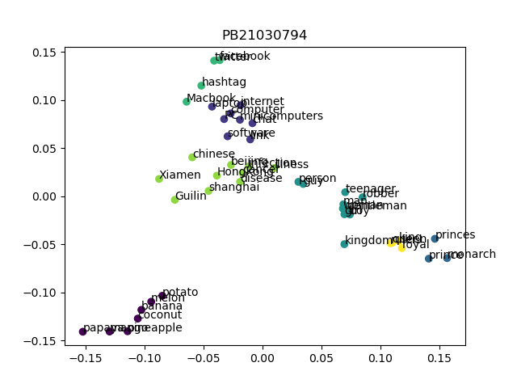

# 人工智能第二次实验 实验报告

> 王道宇  PB21030794

## part1

### 决策树

#### 实验目的

使用 Obesity Levels 数据集，分割训练集和测试集，在训练集上建立决策树（DecisionTree），并在测试集上测试决策树分类的准确率。

#### 代码解释

1. 树的结点

   对于任何的树型结构，首先需要定义其结点的类型。结点分为叶子结点和非叶子结点，二者最显著的区别就是叶子节点有**值** `value`，表示该叶子结点的分类；同样的，非叶子结点需要有**对应最佳分割的特征** `feature_idx`，以及 **最佳分割** `splits`，可以类比为子树结点。

   `splits` 为一个字典，为了区分离散和连续类别，我们将离散类别 `splits` 中的键设为该类的每个离散特征，例如性别中的 `male` 和 `female`，将连续类别 `splits` 的键设为 `left` 和 `right`，同时记录一个 `threthold` 作为连续类别的分割点。

   这样，树的结点的定义如下：

   ```python
   class MetaTreeNode:
           def __init__(self, feature_idx=None, splits=None, threshold=None, 						value=None):
               self.feature_idx = feature_idx
               self.splits = splits  # 分割字典，离散特征：键为特征属性值；连续特征：键为'left'和'right'，值为子树节点
               self.threshold = threshold  # 连续特征的划分点，离散特征为 None
               self.value = value  # 叶节点的取值，也就是 _y 中的某个值，仅当节点是叶节点时使用
   ```

2. 计算信息增益

   计算离散类别的信息增益的公式为：
   $$
   Gain(D, a) = Ent(D)-\sum_{i} \frac{|D_i|}{|D|}Ent(D_i)
   $$
   计算连续类别的信息增益，则将取值集合按从小到大排序，再取所有二分点来按照离散值的方式选择最优划分，不再赘述。

   由上述内容可知，为了计算信息增益，需要准备一些辅助函数，比如计算熵以及判断特征类型。

   - 计算熵的经典实现很多，不再赘述

   - 为了判断特征类型，对决策树类中传递了一个参数 `threshold`，当一个特征中 unique 值的数量与总数之比大于阈值，则认为特征为连续的。相反则为离散的。

     当然如果这个特征列的样本数过少，则会考虑增加阈值，避免误判。
     
     ```python
     def __feature_type(self, _X):
             """
             :param _X: 特征列
             :return: 'discrete' or 'continuous'
             """
             unique_values = np.unique(_X)
             unique_ratio = len(unique_values) / len(_X)
             if len(_X) < int(1 / self.threshold):
                 threshold = 0.5
             else:
                 threshold = self.threshold
             if unique_ratio > threshold:
                 return 'continuous'
             else:
                 return 'discrete'
     ```

   这样，计算信息增益的函数也非常容易了，这里只以连续变量为例：

   ```python
   else:
        # 连续变量，找到最佳划分点
        sorted_indices = np.argsort(_X)
        sorted_values = _X[sorted_indices]
        sorted_y = _y[sorted_indices]
   
        for i in range(1, len(sorted_values)):
            if sorted_values[i] != sorted_values[i - 1]:
                threshold = (sorted_values[i] + sorted_values[i - 1]) / 2
                subset_left, subset_right = sorted_y[:i], sorted_y[i:]
                weighted_left, weighted_right = ...
                subset_entropy = weighted_left * entropy_left + weighted_right 								* entropy_right
                gain = total_entropy - subset_entropy
                if gain >= feature_gain:
                    # 这里不能只用大于，因为可能出现 gain 为 0 的情况
                    feature_gain = gain
                    feature_threshold = threshold
   
           return feature_gain, feature_threshold
   ```

3. 计算最佳分割

   计算最佳分割，只需要遍历每一个特征，应用计算信息增益的函数，并且根据特征类型，计算对应的分割，取出最大信息增益对应的最佳分割，用于之后创建子树。

   ```python
   def __best_split(self, _D, _y):
        for feature_idx in range(num_features):
           # 如果该特征是连续特征，那么最终只会有一个最优划分点，也就是两棵子树
           # 如果该特征是离散特征，那么要按特征的值来分割
           feature_values = _D[:, feature_idx]
           feature_type = self.__feature_type(feature_values)
   
           gain, threshold = self.__calc_information_gain(feature_values, _y, feature_type)
   
           splits = {}  # 键为特征取值，值为子树节点下标
           if feature_type == 'discrete':
                   # 如果该特征是离散特征，那么按特征的值来分割
                   unique_values = np.unique(feature_values)
                   for value in unique_values:
                       indices = _D[:, feature_idx] == value
                       splits[value] = indices
           elif feature_type == 'continuous':
                   # 如果该特征是连续特征，此时可以确定最优划分点，按最优划分点分割
                   assert threshold is not None
                   left_indices = _D[:, feature_idx] < threshold
                   right_indices = _D[:, feature_idx] >= threshold
                   splits['left'] = left_indices
                   splits['right'] = right_indices
   
           if gain >= best_gain:
                   best_gain = gain
                   best_feature_idx = feature_idx
                   best_splits = splits
                   best_threshold = threshold
           return best_feature_idx, best_splits, best_threshold
   ```

4. 应用算法，建立决策树

   这里根据算法和之前的辅助函数，建立决策树即可，需要注意的是，决策树有四个终止条件。

   - 超过最大深度或样本数不足以再分割，返回叶子节点
   - X 中所有样本属于同一类别，返回叶子节点
   - A 为空或样本在 A 上取值相同，返回叶子节点
   - 若子树节点样本数不大于 min_samples_leaf，返回叶子节点，将该节点的类别值设为其父结点 X 中样本最多的类别

   应用算法即可，不再赘述。

5. 预测

   预测即递归向下的搜索过程，同样的，需要分特征为离散还是连续。

   ```python
   def __predict(self, _x, node):
           """
           :param _x: 一条样本
           :param node: 当前节点
           :return: 预测值
           """
           if node.feature_idx is None:
               # 到达叶子节点
               return node.value
           else:
               feature_value = _x[node.feature_idx]
               if node.threshold is not None:
                   # 连续特征
                   if feature_value < node.threshold:
                       return self.__predict(_x, node.splits['left'])
                   else:
                       return self.__predict(_x, node.splits['right'])
               else:
                   # 离散特征
                   if feature_value in node.splits.keys():
                       return self.__predict(_x, node.splits[feature_value])
                   else:
                       # 未知的特征值，返回 X 中样本最多的类别
                       return node.value
   ```

#### 实验结果

使用 Obesity Levels 数据集，应用 `sklearn` 中的 DecisionTreeClassifier 类，以及自行实现的决策树类 MyDecisionTreeClassifier，保持参数相同：

| 参数              | 值   |
| ----------------- | ---- |
| max_depth         | 10   |
| max_samples_split | 2    |
| max_samples_leaf  | 1    |

实验结果为：

| 决策树类       | 准确率             |
| -------------- | ------------------ |
| sklearn 标准库 | 0.933806146572104  |
| 自行实现       | 0.9361702127659575 |

可以看到，分类效果几乎相同，说明自行实现决策树的正确性。

### PCA & Kmeans

#### 实验目的

1. 准备一定数量的单词作为输入，借助 gensim 库提供的 api 查询预先已经训练好的词向量权重 GoogleNews-vectors-negative300.bin，从而获得这些输入词的高维向量表示。
2. 对这些输入的向量表示，首先使用主成分分析算法 (PCA)进行高维向量的降维处理，获得维度为 2 的低维表示后画出对应的散点图。
3. 根据低维的向量表示进行 KMeans 聚类分析

#### 代码解释

1. Kernel PCA

   - 简介

     KernelPCA（核主成分分析）是一种非线性降维技术，通过在原始数据空间中应用核函数，将数据映射到高维空间，然后在高维空间中进行PCA操作，从而捕捉到数据的非线性结构。

   - 代码分析

     - 核函数

       - 高斯径向基函数核（RBF核）

         RBF核是最常用的核函数之一，用于度量数据点之间的相似性。参数`gamma`控制了高斯函数的宽度。这里计算了所有数据点对之间的平方欧氏距离矩阵，然后应用高斯函数。

         ```python
         def __rbf_kernel(self, X):
             if self.gamma is None:
                 self.gamma = 1 / X.shape[1]
             sq_dists = np.sum(X ** 2, axis=1).reshape(-1, 1) - 2 * X @ X.T + np.sum(X ** 2, axis=1)
             return np.exp(-self.gamma * sq_dists)
         ```

       - 多项式核
       
         多项式核通过计算数据点内积并加上一个常数`c`，然后取幂得到。参数`degree`是多项式的度。
       
         ```python
         def __poly_kernel(self, X):
             return (X @ X.T + self.c) ** self.degree
         ```
       
       - Sigmoid 核
       
         Sigmoid 核通过计算数据点内积并加上常数`c`，再应用双曲正切函数。参数`alpha`和`c`是可调参数。
       
         ```python
         def __sigmoid_kernel(self, X):
             return np.tanh(self.alpha * X @ X.T + self.c)
         ```

     - 核矩阵中心化
     
       核矩阵中心化是KernelPCA的重要步骤。原始核矩阵`K`经过减去均值矩阵后，得到了中心化的核矩阵。这一步保证了数据在高维空间中的中心化。
     
       ```python
       def fit_transform(self, X):
           n_samples = X.shape[0]
           K = self.__kernel_function(X)
           one_n = np.ones((n_samples, n_samples)) / n_samples
           K = K - one_n @ K - K @ one_n + one_n @ K @ one_n
       ```

     - 计算特征值和特征向量，投影到主成分空间
     
       对中心化后的核矩阵`K`进行特征值分解，得到特征值和特征向量。然后按特征值从大到小排序，选择前`n_components`个特征值和对应的特征向量。最后，将数据点投影到主成分空间，得到降维后的数据表示。
     
       ```python
       eigenvalues, eigenvectors = np.linalg.eigh(K)
       idx = eigenvalues.argsort()[::-1]
       self.eigenvalues = eigenvalues[idx][:self.n_components]
       self.eigenvectors = eigenvectors[:, idx][:, :self.n_components]
       
       return K @ self.eigenvectors @ np.diag(1 / np.sqrt(self.eigenvalues))
       ```

2. Kmeans

   - 简介

     KMeans算法是一种常用的聚类算法，通过迭代优化，将数据集划分为`k`个簇，使得每个簇内的数据点更加紧密。本文将详细解释KMeans类的实现代码，并从中心初始化、点分配、中心更新和迭代收敛等角度进行分析。

   - 代码分析

     - 中心初始化
     
       中心初始化是KMeans算法的第一步。这里使用随机选择数据集中的点作为初始簇中心。通过`np.random.choice`函数，从数据集中随机选择`n_clusters`个不重复的样本点作为初始中心。
     
       ```python
       def __init_centers(self, points):
           n_samples = points.shape[0]
           indices = np.random.choice(n_samples, self.n_clusters, replace=False)
           return points[indices]
       ```
   
     - 点分配
     
       点分配步骤通过计算每个数据点到各个簇中心的距离，将每个数据点分配到距离最近的簇。距离计算使用欧氏距离的平方和。`np.argmin`函数找到距离最小的簇中心索引。
     
       ```python
       def __assign_points(self, points):
           dists = np.sum((points[:, np.newaxis] - self.centers) ** 2, axis=2)
           return np.argmin(dists, axis=1)
       ```

     - 中心更新
     
       中心更新步骤根据每个簇中的数据点，重新计算簇中心。通过`labels`数组，将每个点分配到对应的簇，然后计算每个簇中所有点的均值作为新的簇中心。
     
       ```python
       def __update_centers(self, points):
           labels = self.__assign_points(points)
           new_centers = np.array([points[labels == i].mean(axis=0) for i in range(self.n_clusters)])
           return new_centers
       ```
     
      - 迭代收敛
     
        `fit`方法是KMeans算法的核心部分。首先初始化簇中心，然后进行迭代。在每次迭代中，更新簇中心并检查是否收敛（即新的簇中心和旧的簇中心几乎相等）。如果收敛，则提前终止迭代。
     
        ```python
        def fit(self, points):
            self.centers = self.__init_centers(points)
            for _ in range(self.max_iter):
                new_centers = self.__update_centers(points)
                if np.allclose(self.centers, new_centers):
                    break
                self.centers = new_centers
        ```
     
      - 簇分配预测
     
        `predict`方法使用训练好的簇中心对新数据点进行簇分配。该方法与`__assign_points`类似，计算每个点到簇中心的距离并进行分配。
     
        ```python
        def predict(self, points):
            return self.__assign_points(points)
        ```

#### 实验结果

在应用 Kernel PCA 和 Kmeans 技术之后，绘制出的词聚类的图像为：



## part2

### Transformer Decoder

#### 实验目的

使用专家网络（Mixture of Experts）和 Top-k Router，代替 Transformer 模型中 feed-forward layers，训练一个 Transformer Decoder，用于莎士比亚文集的续写和生成。

#### 代码解释

1. 准备分词器，并将原始文本分词
2. 设置模型，包括多头注意力层和专家网络层
3. 训练并记录损失

#### 实验结果

## bonus

### 对抗网络 

#### 实验目的


#### 代码解释


#### 实验结果